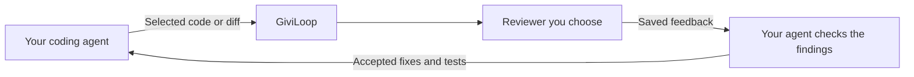

# GiviLoop

**Double-check your code. Put your existing chat access to work.**

Bring a second model into your development loop. GiviLoop packages selected code or Git changes, asks a reviewer you choose, and returns the saved feedback to your coding agent. Your agent can then check the findings and apply the fixes you want.

Web chat + local models · CLI + MCP · Open source · MIT



**Choose the reviewer. Keep the review. Decide what changes.**

> **Release 0.3.0.** Focused on the existing review loop and saved feedback. The optional ChatGPT browser adapter remains experimental: access depends on the website and provider terms. See [release scope](docs/releases/0.3.0.md).

## Why use it?

Two jobs, using the tools already available:

- **Double Check.** Ask another model to challenge selected files or Git changes, then have your coding agent verify each finding before applying a fix. Keep the request and response together in `.giviloop/`.
- **Use existing chat access for a review.** A review performed on a chat website makes no separately billed model API call through GiviLoop. This can avoid an extra API expense when you would otherwise pay for that review through an API. Your chat plan, quotas and provider terms still apply.

This is a choice about **where you spend your inference budget**, not a measured reduction in total tokens. Your coding agent still consumes its own quota when preparing context and assessing the answer. [Costs, token accounting and access](docs/costs-and-access.md).

A second model can catch a missed edge case. It can also invent one. Checking its claims against the code and tests is what makes Double Check useful.

## Double Check, today

With the MCP server connected, ask your coding agent:

```text
Double-check my current Git changes with GiviLoop.
Use ChatGPT web in auto mode with background enabled.
Ask for concrete bugs, supporting code, and regression cases.
Read the saved review in analyze-only mode.
Check each finding and report confirmed, dismissed, or unverified, with reasons.
Do not edit files.
```

The web path needs an authenticated, available browser session. It is an optional experimental integration, not provider-authorized API access: OpenAI's European terms prohibit automatic extraction of output. A disclaimer does not remove that restriction. For manual web transfer or an automatic local reviewer, see the [full recipe](docs/double-check.md) and [access note](docs/costs-and-access.md).

This is an **agent workflow using existing tools**. GiviLoop saves and returns the review; your coding agent performs the verification. A dedicated Double Check command and structured evidence records are [proposed next steps](docs/roadmap.md), not shipped features.

## Try a first review

You need Node.js 20+ and Git. Clone and build GiviLoop:

```sh
git clone https://github.com/vgflutter/GiviLoop.git
cd GiviLoop
npm ci
npm run build
```

For the optional automatic web path, install Google Chrome and authenticate in the dedicated profile:

```sh
npm run givi -- browser login
# Finish signing in, then close that dedicated Chrome window.
npm run givi -- browser check

npm run givi -- ask --repo . --file examples/double-check/sum.ts \
  --question "Check the stated contract. Find a concrete bug, suggest the smallest fix and regression tests." \
  --send chatgpt-web --mode auto --background
```

The exchange runs automatically in a minimized Chrome window. A human verification request can bring the window forward; verification may recur. Repeated challenges stop with a specific error. Background mode resolved the observed 403; **headless remains blocked in the tested session**. [Browser troubleshooting](docs/troubleshooting.md#human-verification-and-repeated-challenges).

The [example](examples/double-check/sum.ts) is deliberately buggy: `sum([])` throws instead of returning zero. A useful review identifies the missing initial accumulator and proposes a test for the empty array. This is a small reproducible fixture, not a quality benchmark.

GiviLoop prints the saved request and response paths. It leaves the source unchanged. Ask your agent to read that response and check the recommendation; then try a file from your own repository with `--repo /path/to/repo --file src/cart.ts`.

Prefer manual web transfer? Prepare without `--send`, use `givi copy --open`, and import the answer you copied with `givi ingest`. Prefer full local automation? Use an installed [Ollama model](docs/ollama.md) or another [local engine](docs/local-engines.md). The [Double Check recipe](docs/double-check.md) includes both paths. There is no hosted GiviLoop account to create.

## Use it from your coding agent

Configure your MCP client to launch the built server:

```json
{
  "mcpServers": {
    "giviloop": {
      "command": "node",
      "args": ["/absolute/path/to/GiviLoop/dist/mcp-server.js"]
    }
  }
}
```

This is the common JSON form; use your client's equivalent stdio-server configuration. GiviLoop exposes tools for model discovery, preparing context, requesting a review, and reading a saved response. Configure the client's request timeout to cover the inference budget.

Start with `reviewResponseMode: "analyze-only"` to discuss feedback without requesting edits. Use `"act"` when you want your agent to evaluate the findings, apply sensible fixes and run checks. These are instructions to the host agent; GiviLoop does not execute patches or tests itself.

[Tool reference and advanced flows →](docs/usage.md#mcp-tools)

## See the loop

<video src="https://github.com/user-attachments/assets/6d294d9f-8ac4-4f4a-bbc7-fb0638b7f297" controls width="100%"></video>

The IDE demo shows preparing a review, retrieving the answer and handing it back to the coding agent. The [console demo and commands](docs/usage.md#console-usage) cover terminal use.

## Reviewers and current status

| Integration | What is available | Validation and limits |
| --- | --- | --- |
| **Ollama** | Automatic local review through CLI/MCP | Real reviews with downloaded weights. [Setup and results](docs/ollama.md). |
| **llama.cpp / LM Studio** | Automatic local review through CLI/MCP | Real reviews with an explicitly loaded model. [Setup](docs/local-engines.md). |
| **MLX-LM** | Local inference on Apple Silicon | Real reviews tested; the upstream server remains experimental. [Details](docs/local-engines.md). |
| **DwarfStar** | Adapter for antirez's native server | Native synthetic GPU/server test passed; trained-model review still needs suitable hardware. [Requirements](docs/dwarfstar.md). |
| **ChatGPT web** | Optional automatic visible/background session | Real authenticated CLI/MCP reviews completed. Headless remains blocked in the tested session; named-model selection and long reasoning are not validated. [Evidence](docs/chatgpt-403-resolution-2026-09-21.md). |
| **Manual chat** | Copy a prepared prompt, then ingest an answer you copied | ChatGPT and Claude prompt formats. [Workflow](docs/usage.md#manual-flows). |

For ChatGPT's tested background path, use `--send chatgpt-web --mode auto --background`. Login and occasional human verification may be required. The browser integration's technical success does not establish permission under provider terms; read the [provider-access note](docs/accesso-provider.md).

Local adapters connect to loopback servers, require an explicit model and never silently fall back to cloud inference. Configure the runtime for local execution. Returning its answer to a cloud coding agent still shares that answer with the agent provider.

## What we have measured

The [local validation](docs/production-validation-2026-09-21.md) records successful reviews **and incorrect advice**. In a small MLX trial, both reviews without thinking were wrong; the tested thinking configuration identified both defects, while still making some incorrect secondary suggestions. That is a reason to verify findings, not proof that one setting will always win.

The [browser validation](docs/chatgpt-403-resolution-2026-09-21.md) includes two complete background reviews through CLI and MCP, with eleven independently checked regression cases. These fixtures establish that the workflow runs; they do not establish superiority over another reviewer.

GiviLoop records local runtime token counts when available. **Total token savings and equivalence to larger models have not been demonstrated.** A second review adds work; focused context and local inference give you choices about where that work happens.

## After this release

The release stays focused on **Double Check and reviewing through existing chat access**. No new provider or multi-agent panel is required to try it. Next, collect real usage and false positives, then add structured finding evidence and rechecks. See the [roadmap](docs/roadmap.md).

Try it on a real change. Open an issue with a small reproducible example: what the reviewer found, whether the finding held up, and where the workflow helped or got in the way. Reports of false positives are as useful as successful demos. Avoid sharing private source or credentials. Contributions to examples, adapters and onboarding are welcome; start with [CONTRIBUTING.md](CONTRIBUTING.md).

## Documentation and development

- [Double Check recipe](docs/double-check.md) · [CLI/MCP usage reference](docs/usage.md)
- [Costs and access](docs/costs-and-access.md) · [Release notes](docs/releases/0.3.0.md)
- [Local engine setup](docs/local-engines.md) · [Troubleshooting](docs/troubleshooting.md)
- [Roadmap proposal](docs/roadmap.md) · [Data handling](docs/usage.md#safety-and-legal)

Add `.giviloop/` to the reviewed repository's `.gitignore`: run files can contain source code and prompts. Redaction is best effort; source archives are not redacted line by line. Older completed runs are pruned, so export results you want to retain. Details are in the [usage reference](docs/usage.md#output-files).

```sh
npm test
npm run test:browser
npm run test:package -- --browser
```

Browser tests use local fixtures and isolated profiles. Packaging checks install and test the tarball without publishing it. See [contributing](CONTRIBUTING.md) for prerequisites and CI details.

## License

[MIT](LICENSE). Independent project; not affiliated with model or service providers. Provider terms and model licenses apply separately.
